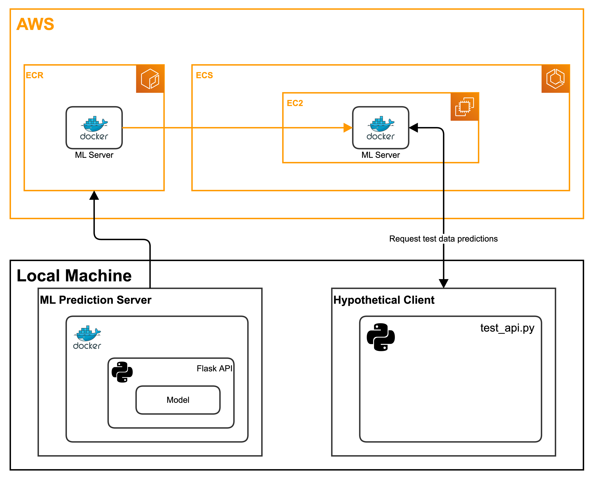

# Local to Cloud ML

The goal of the project is to familiarize myself with deploying statistical models into the cloud. The goal is **not**
to build/create the most interesting statistical model that solves an interesting problem.

# General Map 

## Steps to build & test "ML Prediction Server" (locally)

1. Run [train_model.py](train_model.py) - `$ python train_model.py`.
* Trains & saves a model.
* Saves a test data set.
2. Run `$ docker build --tag ml-server:latest .`.
* Build a docker image using the model build in #1 and [app.py](app.py).
3. Run `$ docker run --publish <host_port>:<container_port> ml-server`, which in this case, is:
	`$ docker run --publish 80:80 ml-server`
* Runs the container, mapping port 80 of the container to port 80 of the host.
4. (In a separate shell) Run `$ python test_api.py 127.0.0.1` from the command line.
* Loads the test data set from #1, and sends a sample to the Docker Flask API. Should output the class predictions for
  the requested instances.

## Steps to move "ML Prediction Server" to AWS Cloud

1. Complete all steps in "Steps to recreate/test (locally)" to ensure everything works properly.
2. Change directories to [aws_setup ](aws_setup/) `$ cd aws_setup`.
3. Run [setup_aws_resources.sh](setup_aws_resources.sh) `$ bash setup_aws_resources.sh`.
## Steps to test if the service is working 

1. Run `$ python test_api.py <instance_public_ip_address>`. The accuracy of the test set will be printed.
